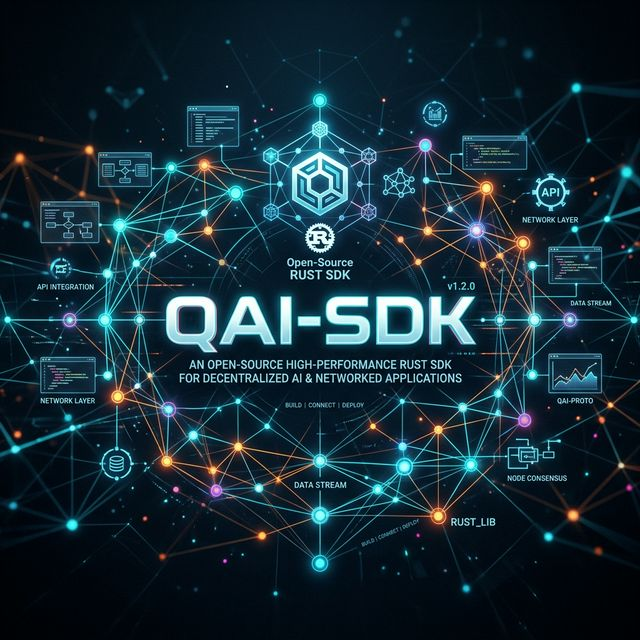
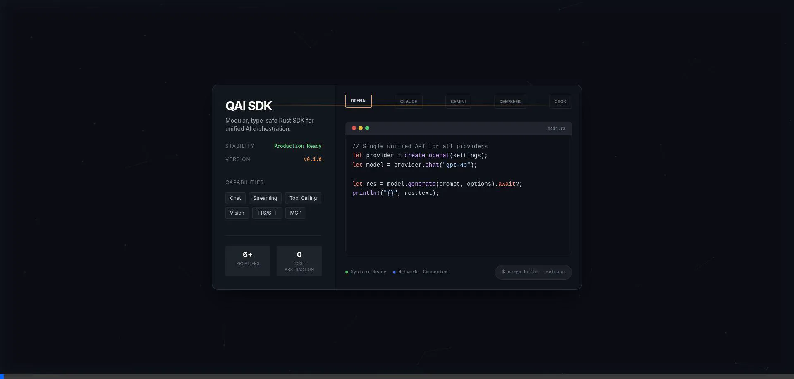

# QAI SDK

<p align="center">
  
</p>

<div align="center">
  
[](https://crates.io/crates/qai-sdk)
[](https://crates.io/crates/qai-sdk)
[](https://docs.rs/qai-sdk)
[](https://github.com/keyvanarasteh/qai-sdk/actions)
[](https://www.rust-lang.org)
[](https://github.com/keyvanarasteh/qai-sdk)

[](https://github.com/keyvanarasteh/qai-sdk/stargazers)
[](https://github.com/keyvanarasteh/qai-sdk/issues)
[](https://github.com/keyvanarasteh/qai-sdk/pulls)

</div>

A modular, type-safe Rust SDK for AI providers. One unified API across **OpenAI**, **Anthropic Claude**, **Google Gemini**, **DeepSeek**, **xAI Grok**, and any **OpenAI-compatible** endpoint.

## Features

| Capability | OpenAI | Anthropic | Google | DeepSeek | xAI | Compatible |
|---|:---:|:---:|:---:|:---:|:---:|:---:|
| Chat / Language Model | ✅ | ✅ | ✅ | ✅ | ✅ | ✅ |
| Streaming | ✅ | ✅ | ✅ | ✅ | ✅ | ✅ |
| Tool Calling | ✅ | ✅ | ✅ | ✅ | ✅ | ✅ |
| Structured Output (`generate_object`) | ✅ | ✅ | ✅ | ✅ | ✅ | ✅ |
| Provider Registry | ✅ | ✅ | ✅ | ✅ | ✅ | ✅ |
| Middleware Layer | ✅ | ✅ | ✅ | ✅ | ✅ | ✅ |
| Universal Agent | ✅ | ✅ | ✅ | ✅ | ✅ | ✅ |
| Vision / Multimodal | ✅ | ✅ | ✅ | — | — | — |
| Embeddings | ✅ | — | ✅ | — | — | — |
| Image Generation | ✅ | — | ✅ | — | — | — |
| Speech (TTS) | ✅ | — | — | — | — | — |
| Transcription (STT) | ✅ | — | — | — | — | — |
| Text Completion | ✅ | — | — | — | — | — |
| Responses API | ✅ | — | — | — | — | — |
| Model Context Protocol (MCP) | ✅ | ✅ | ✅ | ✅ | ✅ | ✅ |

## Unified API Demo

<p align="center">
  <a href="playground.html">
    
  </a>
</p>

*The `playground.html` showcase demonstrates the lightning-fast API flexibility. [Open it locally](playground.html) to interact with it directly.*

## Quick Start

Add to your `Cargo.toml`:

```toml
[dependencies]
qai-sdk = "0.1"
tokio = { version = "1", features = ["full"] }
```

By default, all providers are enabled. To optimize compile times, disable default features and select only the providers you need:

```toml
[dependencies]
qai-sdk = { version = "0.1", default-features = false, features = ["openai", "anthropic"] }
```

### Basic Usage

```rust
use qai_sdk::prelude::*;

#[tokio::main]
async fn main() -> anyhow::Result<()> {
    // Create a provider
    let provider = create_openai(ProviderSettings {
        api_key: Some("sk-...".to_string()),
        ..Default::default()
    });

    // Get a chat model
    let model = provider.chat("gpt-4o");

    // Generate a response
    let result = model.generate(
        Prompt {
            messages: vec![Message {
                role: Role::User,
                content: vec![Content::Text {
                    text: "Hello, world!".to_string(),
                }],
            }],
        },
        GenerateOptions {
            model_id: "gpt-4o".to_string(),
            max_tokens: Some(100),
            temperature: Some(0.7),
            top_p: None,
            stop_sequences: None,
            tools: None,
        },
    ).await?;

    println!("{}", result.text);
    Ok(())
}
```

### Streaming

```rust
use qai_sdk::prelude::*;
use futures::StreamExt;

let model = provider.chat("gpt-4o");
let mut stream = model.generate_stream(prompt, options).await?;

while let Some(part) = stream.next().await {
    match part {
        StreamPart::TextDelta { delta } => print!("{delta}"),
        StreamPart::Finish { finish_reason } => println!("\n[{finish_reason}]"),
        _ => {}
    }
}
```

### Switch Providers in One Line

```rust
// OpenAI
let provider = create_openai(settings.clone());
// Anthropic
let provider = create_anthropic(settings.clone());
// Google Gemini
let provider = create_google(settings.clone());
// DeepSeek
let provider = create_deepseek(settings.clone());
// xAI Grok
let provider = create_xai(settings.clone());
// Any OpenAI-compatible API
let provider = create_openai_compatible(settings);
```

### Provider Registry — Resolve Models by String

```rust
use qai_sdk::core::registry::ProviderRegistry;

let registry = ProviderRegistry::new()
    .register("openai", openai_provider)
    .register("anthropic", anthropic_provider);

let model = registry.language_model("openai:gpt-4o")?;
let result = model.generate(prompt, options).await?;
```

### Structured Output — Force JSON Schema Conformance

```rust
use qai_sdk::core::structured::*;

let result = generate_object(
    &model,
    "Generate a user profile for John Doe, age 30",
    ObjectGenerateOptions {
        model_id: "gpt-4o".to_string(),
        schema: serde_json::json!({
            "type": "object",
            "properties": {
                "name": { "type": "string" },
                "age": { "type": "integer" }
            },
            "required": ["name", "age"]
        }),
        mode: OutputMode::Json,
        ..Default::default()
    },
).await?;
println!("{}", result.object); // {"name": "John Doe", "age": 30}
```

### Middleware — Composable Model Wrappers

```rust
use qai_sdk::core::middleware::*;

let wrapped = wrap_language_model(
    model,
    vec![Box::new(DefaultSettingsMiddleware {
        temperature: Some(0.7),
        max_tokens: Some(2048),
        top_p: None,
    })],
);
// Every call now uses temperature=0.7 if not explicitly set
```

### Universal Agent — Multi-Step Tool Loop

```rust
use qai_sdk::core::agent::Agent;

let agent = Agent::builder()
    .model(model)
    .tools(vec![weather_tool, search_tool])
    .tool_handler(|name, args| async move {
        match name.as_str() {
            "get_weather" => Ok(serde_json::json!({"temp": "22°C"})),
            _ => Err(anyhow::anyhow!("Unknown tool")),
        }
    })
    .max_steps(10)
    .system("You are a helpful assistant.")
    .build()
    .expect("agent build");

let result = agent.run("What's the weather?").await?;
println!("{}  ({} steps)", result.text, result.total_steps);
```

## Documentation

Dive deep into specific provider features and initialization parameters in our comprehensive module docs:

- [Core Interoperability `qai_sdk::core`](docs/core.md)
- [OpenAI Provider `qai_sdk::openai`](docs/openai.md)
- [Anthropic Provider `qai_sdk::anthropic`](docs/anthropic.md)
- [Google Gemini Provider `qai_sdk::google`](docs/google.md)
- [DeepSeek Provider `qai_sdk::deepseek`](docs/deepseek.md)
- [xAI Grok Provider `qai_sdk::xai`](docs/xai.md)
- [OpenAI Compatible Provider `qai_sdk::openai_compatible`](docs/openai_compatible.md)
- [Model Context Protocol `qai_sdk::mcp`](docs/mcp.md)
- [Structured Output `qai_sdk::core::structured`](docs/structured.md)
- [Provider Registry `qai_sdk::core::registry`](docs/registry.md)
- [Middleware `qai_sdk::core::middleware`](docs/middleware.md)
- [Universal Agent `qai_sdk::core::agent`](docs/agent.md)

## Architecture

`qai-sdk` is a single, monolithic crate designed with zero-cost abstractions. Providers are organically separated via modular architecture and gated by Cargo features, keeping compile times fast when you only need specific integrations:

```
qai-sdk
├── core
│   ├── traits          — LanguageModel, EmbeddingModel, ImageModel, SpeechModel, TranscriptionModel
│   ├── structured      — generate_object() / stream_object() with JSON Schema validation
│   ├── registry        — ProviderRegistry for "provider:model" string resolution
│   ├── middleware      — Composable LanguageModelMiddleware (DefaultSettings, ExtractReasoning)
│   └── agent           — Universal Agent with builder pattern & max_steps tool loop
├── openai              — OpenAI API (GPT, DALL-E, Whisper, TTS, Responses)
├── anthropic           — Anthropic API (Claude)
├── google              — Google API (Gemini)
├── deepseek            — DeepSeek API (via OpenAI-compatible pipeline)
├── xai                 — xAI API (Grok, via OpenAI-compatible pipeline)
├── openai_compatible   — Any OpenAI-compatible endpoint (Ollama, LM Studio)
└── mcp                 — Model Context Protocol (JSON-RPC, Stdio/SSE, resources, prompts)
```

## Examples

See the [`examples/`](examples/) directory for 17 comprehensive examples covering:

- Basic chat, streaming, and multimodal conversations
- Tool calling / function calling
- Embeddings, image generation, speech, and transcription
- OpenAI Responses API
- Error handling patterns
- Provider factory pattern
- OpenAI-compatible endpoints (Ollama, LM Studio, etc.)

Run an example:

```bash
cp .env.example .env
# Fill in your API keys
cargo run --example chat_basic
```

## Environment Variables

| Variable | Provider |
|---|---|
| `OPENAI_API_KEY` | OpenAI |
| `ANTHROPIC_API_KEY` | Anthropic |
| `GOOGLE_API_KEY` | Google Gemini |
| `DEEPSEEK_API_KEY` | DeepSeek |
| `XAI_API_KEY` | xAI |

## Contributing

See [CONTRIBUTING.md](CONTRIBUTING.md) for guidelines.

## License

Licensed under either of:

- [MIT License](LICENSE-MIT)
- [Apache License, Version 2.0](LICENSE-APACHE)

at your option.

## Author

**Keyvan Arasteh** — [@keyvanarasteh](https://github.com/keyvanarasteh)
