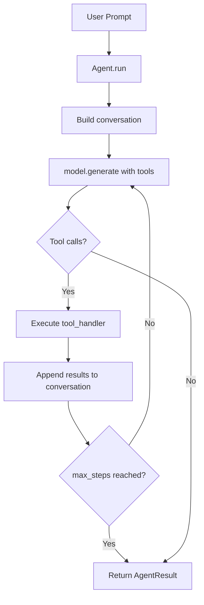

<p align="center">
  
</p>

# Universal Agent

A generalized tool-calling loop that works with **any** `LanguageModel` and tool set.

## How It Works



## Usage

```rust
use qai_sdk::core::agent::Agent;
use qai_sdk::core::types::ToolDefinition;

let weather_tool = ToolDefinition {
    name: "get_weather".into(),
    description: "Get current weather for a city".into(),
    parameters: serde_json::json!({
        "type": "object",
        "properties": {
            "city": { "type": "string" }
        },
        "required": ["city"]
    }),
};

let agent = Agent::builder()
    .model(my_model)
    .model_id("gpt-4o")
    .tools(vec![weather_tool])
    .tool_handler(|name, args| async move {
        match name.as_str() {
            "get_weather" => {
                let city = args["city"].as_str().unwrap_or("unknown");
                Ok(serde_json::json!({"city": city, "temp": "22°C", "condition": "sunny"}))
            }
            _ => Err(anyhow::anyhow!("Unknown tool: {name}")),
        }
    })
    .max_steps(10)
    .system("You are a helpful weather assistant.")
    .build()
    .expect("agent build");

let result = agent.run("What's the weather in Istanbul?").await?;

println!("Answer: {}", result.text);
println!("Steps: {}", result.total_steps);
for step in &result.steps {
    for tc in &step.tool_calls {
        println!("  Called {} -> {:?}", tc.name, tc.result);
    }
}
```

## Builder Options

| Method | Description | Default |
|---|---|---|
| `.model(m)` | Language model instance | Required |
| `.model_id(id)` | Model ID string | `""` |
| `.tools(vec)` | Available tool definitions | `[]` |
| `.tool_handler(fn)` | Async tool execution closure | Required |
| `.max_steps(n)` | Maximum tool-call loop iterations | `10` |
| `.system(s)` | System prompt | `None` |
| `.temperature(t)` | Generation temperature | `None` |
| `.max_tokens(n)` | Max tokens per generation | `None` |

## Result Types

- **`AgentResult`** — `.text`, `.steps`, `.total_steps`, `.finish_reason`
- **`AgentStep`** — `.step` (index), `.text`, `.tool_calls`
- **`AgentToolCall`** — `.name`, `.arguments`, `.result`
