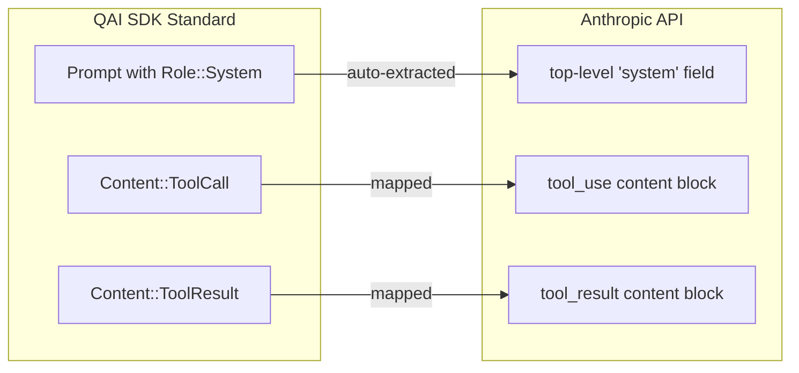

<p align="center">
  
</p>

# Anthropic Provider (`qai_sdk::anthropic`)

Complete integration with the Anthropic Messages API for Claude models. Handles Anthropic's unique API structure — separated system prompts, content blocks, and tool_use patterns — transparently.

---

## Implemented Traits

| Trait | Models |
|---|---|
| `LanguageModel` | Claude 3.5 Sonnet, Claude 3 Opus, Claude 3 Sonnet, Claude 3 Haiku |

---

## Initialization

```rust
use qai_sdk::prelude::*;

let provider = create_anthropic(ProviderSettings {
    api_key: Some(std::env::var("ANTHROPIC_API_KEY").unwrap()),
    ..Default::default()
});

let model = provider.chat("claude-3-5-sonnet-20241022");
```

### Direct Instantiation

```rust
use qai_sdk::AnthropicModel;
let model = AnthropicModel::new(api_key);
```

### Custom API Version

```rust
let provider = create_anthropic(ProviderSettings {
    api_key: Some(api_key),
    version: Some("2023-06-01".into()), // Override API version
    ..Default::default()
});
```

---

## Chat Generation

```rust
let result = model.generate(
    Prompt {
        messages: vec![
            Message { role: Role::System, content: vec![Content::Text { text: "You are a Rust expert.".into() }] },
            Message { role: Role::User, content: vec![Content::Text { text: "Explain ownership.".into() }] },
        ],
    },
    GenerateOptions {
        model_id: "claude-3-5-sonnet-20241022".into(),
        max_tokens: Some(1024),
        temperature: Some(0.5),
        ..Default::default()
    },
).await?;

println!("{}", result.text);
```

> **Note**: System prompts are automatically extracted from `Role::System` messages and placed in the top-level `system` field to comply with Anthropic API requirements.

---

## Streaming

```rust
use futures::StreamExt;

let mut stream = model.generate_stream(prompt, options).await?;

while let Some(part) = stream.next().await {
    match part {
        StreamPart::TextDelta { delta } => print!("{delta}"),
        StreamPart::Finish { finish_reason } => println!("\n[{finish_reason}]"),
        _ => {}
    }
}
```

The SDK translates Anthropic's proprietary SSE events seamlessly:

| Anthropic Event | SDK StreamPart |
|---|---|
| `message_start` | *(internal)* |
| `content_block_start` | *(internal)* |
| `content_block_delta` → `text_delta` | `StreamPart::TextDelta` |
| `content_block_delta` → `input_json_delta` | `StreamPart::ToolCallDelta` |
| `message_delta` | `StreamPart::Finish` |
| *(usage fields)* | `StreamPart::Usage` |

---

## Tool Calling

```rust
let calculator = ToolDefinition {
    name: "calculate".into(),
    description: "Perform arithmetic".into(),
    parameters: serde_json::json!({
        "type": "object",
        "properties": {
            "expression": { "type": "string" }
        },
        "required": ["expression"]
    }),
};

let result = model.generate(
    prompt,
    GenerateOptions {
        model_id: "claude-3-5-sonnet-20241022".into(),
        tools: Some(vec![calculator]),
        ..Default::default()
    },
).await?;

// Send tool result back
if !result.tool_calls.is_empty() {
    let tc = &result.tool_calls[0];
    let tool_result = execute_tool(&tc.name, &tc.arguments);
    // Append ToolResult to conversation and call generate again
}
```

---

## Vision (Multimodal)

```rust
let prompt = Prompt {
    messages: vec![Message {
        role: Role::User,
        content: vec![
            Content::Text { text: "Describe this diagram.".into() },
            Content::Image { source: ImageSource::Base64 {
                media_type: "image/jpeg".into(),
                data: base64_image,
            }},
        ],
    }],
};
// Claude 3 family natively supports image analysis
```

---

## API Translation Details


