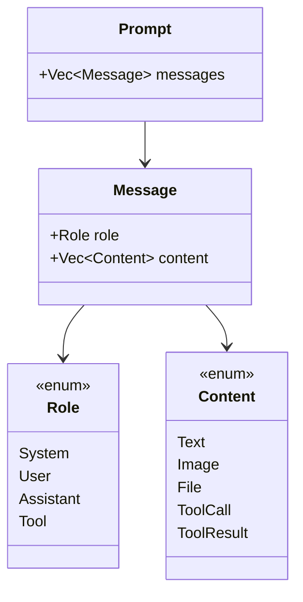

<p align="center">
  
</p>

# Core Interoperability (`qai_sdk::core`)

The `core` module is the backbone of `qai-sdk`. It defines all provider-agnostic abstractions ensuring 100% API compatibility across every AI provider.

---

## Trait Reference

### `LanguageModel` — Chat & Text Generation

```rust
#[async_trait]
pub trait LanguageModel: Send + Sync {
    async fn generate(&self, prompt: Prompt, options: GenerateOptions) -> Result<GenerateResult>;
    async fn generate_stream(&self, prompt: Prompt, options: GenerateOptions) -> Result<BoxStream<'static, StreamPart>>;
}
```

### `EmbeddingModel` — Vector Embeddings

```rust
#[async_trait]
pub trait EmbeddingModel: Send + Sync {
    async fn embed(&self, values: Vec<String>, options: EmbeddingOptions) -> Result<EmbeddingResult>;
}
```

### `ImageModel` — Image Generation

```rust
#[async_trait]
pub trait ImageModel: Send + Sync {
    async fn generate(&self, options: ImageGenerateOptions) -> Result<ImageGenerateResult>;
}
```

### `CompletionModel` — Legacy Text Completion

```rust
#[async_trait]
pub trait CompletionModel: Send + Sync {
    async fn complete(&self, options: CompletionOptions) -> Result<CompletionResult>;
}
```

### `SpeechModel` — Text-to-Speech

```rust
#[async_trait]
pub trait SpeechModel: Send + Sync {
    async fn synthesize(&self, options: SpeechOptions) -> Result<SpeechResult>;
}
```

### `TranscriptionModel` — Speech-to-Text

```rust
#[async_trait]
pub trait TranscriptionModel: Send + Sync {
    async fn transcribe(&self, options: TranscriptionOptions) -> Result<TranscriptionResult>;
}
```

---

## Type Reference

### Conversation Types



| Type | Fields | Description |
|---|---|---|
| `Prompt` | `messages: Vec<Message>` | Full conversation history |
| `Message` | `role: Role`, `content: Vec<Content>` | Single message in conversation |
| `Role` | `System`, `User`, `Assistant`, `Tool` | Message author role |
| `Content::Text` | `text: String` | Plain text content |
| `Content::Image` | `source: ImageSource` | Base64 or URL image |
| `Content::File` | `source: FileSource` | Base64 file attachment |
| `Content::ToolCall` | `id`, `name`, `arguments` | Model-initiated tool call |
| `Content::ToolResult` | `id`, `result` | Tool execution result |

### Generation Types

| Type | Fields | Description |
|---|---|---|
| `GenerateOptions` | `model_id`, `max_tokens`, `temperature`, `top_p`, `stop_sequences`, `tools` | Generation parameters |
| `GenerateResult` | `text`, `usage`, `finish_reason`, `tool_calls` | Complete generation result |
| `ToolDefinition` | `name`, `description`, `parameters` | Tool schema for function calling |
| `ToolCallResult` | `name`, `arguments` | Returned tool call from model |
| `Usage` | `prompt_tokens`, `completion_tokens` | Token usage statistics |

### Streaming Types

| `StreamPart` Variant | Fields | When Emitted |
|---|---|---|
| `TextDelta` | `delta: String` | Each text chunk |
| `ToolCallDelta` | `index`, `id`, `name`, `arguments_delta` | Tool call streaming |
| `Usage` | `usage: Usage` | Final token counts |
| `Finish` | `finish_reason: String` | Stream complete |
| `Error` | `message: String` | Error occurred |

### Provider Settings

| Type | Fields | Description |
|---|---|---|
| `ProviderSettings` | `base_url`, `api_key`, `headers` | Universal provider configuration |

### Embedding, Image, Speech, Transcription Types

| Type | Key Fields |
|---|---|
| `EmbeddingOptions` | `model_id`, `dimensions` |
| `EmbeddingResult` | `embeddings: Vec<Vec<f32>>`, `usage` |
| `ImageGenerateOptions` | `model_id`, `prompt`, `n`, `size`, `quality` |
| `ImageGenerateResult` | `images: Vec<String>`, `revised_prompt` |
| `SpeechOptions` | `model_id`, `input`, `voice`, `response_format`, `speed` |
| `SpeechResult` | `audio: Vec<u8>` |
| `TranscriptionOptions` | `model_id`, `audio: Vec<u8>`, `language`, `prompt`, `temperature` |
| `TranscriptionResult` | `text`, `language`, `duration` |
| `CompletionOptions` | `model_id`, `prompt`, `max_tokens`, `temperature` |
| `CompletionResult` | `text`, `usage`, `finish_reason` |

---

## Error Types

All operations return `Result<T, ProviderError>`.

```rust
pub enum ProviderError {
    Configuration(String),        // Invalid API key, missing config
    RateLimit(String),            // 429 Too Many Requests
    ContextLengthExceeded(String),// Token limit exceeded
    Unauthorized(String),         // 401/403 Authentication failure
    Network(String),              // HTTP/connection errors
    InvalidResponse(String),      // Malformed API response
    NotSupported(String),         // Feature not available for this provider
    Other(anyhow::Error),         // Catch-all
}
```

### Error Handling Example

```rust
use qai_sdk::core::error::ProviderError;

match model.generate(prompt, options).await {
    Ok(result) => println!("{}", result.text),
    Err(ProviderError::RateLimit(msg)) => {
        eprintln!("Rate limited: {msg}. Retrying in 5s...");
        tokio::time::sleep(std::time::Duration::from_secs(5)).await;
    }
    Err(ProviderError::ContextLengthExceeded(msg)) => {
        eprintln!("Too many tokens: {msg}. Truncating prompt...");
    }
    Err(ProviderError::Unauthorized(msg)) => {
        eprintln!("Auth failed: {msg}. Check your API key.");
    }
    Err(e) => eprintln!("Unexpected error: {e}"),
}
```

---

## Architecture Overview

```mermaid
graph TD
    subgraph core["Core Module"]
        LM[LanguageModel]
        EM[EmbeddingModel]
        IM[ImageModel]
        SM[SpeechModel]
        TM[TranscriptionModel]
        CM[CompletionModel]
        REG[ProviderRegistry]
        MW[Middleware]
        AG[Agent]
        SO[Structured Output]
    end
    
    subgraph providers["Provider Implementations"]
        OAI[OpenAI]
        ANT[Anthropic]
        GOO[Google]
        DS[DeepSeek]
        XAI[xAI]
        OC[OpenAI-Compatible]
    end
    
    OAI -->|implements| LM
    OAI -->|implements| EM
    OAI -->|implements| IM
    OAI -->|implements| SM
    OAI -->|implements| TM
    ANT -->|implements| LM
    GOO -->|implements| LM
    GOO -->|implements| EM
    DS -->|implements| LM
    XAI -->|implements| LM
    OC -->|implements| LM
    
    REG -->|resolves| LM
    MW -->|wraps| LM
    AG -->|uses| LM
    SO -->|uses| LM
```


