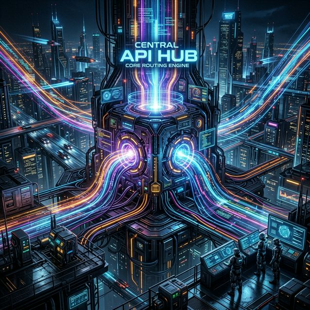

# Core Interoperability (`qai_sdk::core`)

<p align="center">
  
</p>

At the heart of the `qai-sdk` architecture is the `core` module. This module defines the common traits and data structures that all providers implement, ensuring 100% API compatibility across every supported AI model.

## Key Abstractions

### `LanguageModel`
Every provider implements the `LanguageModel` trait, which guarantees you can natively call two primary functions on any instantiated model:

```rust
#[async_trait]
pub trait LanguageModel: Send + Sync {
    /// Generates a complete, single response.
    async fn generate(&self, prompt: Prompt, options: GenerateOptions) -> Result<GenerateResult>;

    /// Stream back chunks of the response in real-time.
    async fn generate_stream(
        &self,
        prompt: Prompt,
        options: GenerateOptions,
    ) -> Result<BoxStream<'static, StreamPart>>;
}
```

### `Prompt`, `Message`, `Role`, `Content`
These structures standardize conversation history and multimodal inputs.

- **Role**: `System`, `User`, `Assistant`, `Tool`
- **Content**: `Text { text: String }`, `Image { media_type, data }`
- **Tool Calls**: First-class support for OpenAI/Anthropic/Gemini function calling patterns.

### `StreamPart`
When streaming (via `generate_stream`), the pipeline emits asynchronous chunks modeled cleanly as an enum:
- `TextDelta { delta: String }`
- `ToolCallDelta { index, id, name, arguments_delta }`
- `Usage { usage: UsageSummary }`
- `Finish { finish_reason: String }`
- `Error { message: String }`

Because every model converts its specific proprietary Server-Sent-Events (SSE) into standard `StreamPart`s, you only ever write your streaming loop logic **once**.
