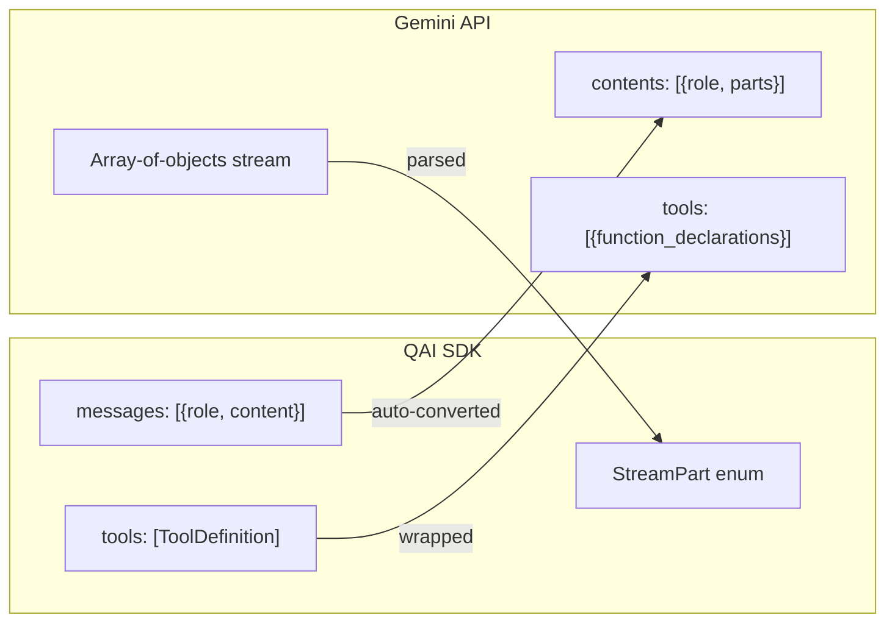

<p align="center">
  
</p>

# Google Gemini Provider (`qai_sdk::google`)

Integration with the Google Generative AI API for the Gemini multimodal model family. Translates Gemini's unique streaming array format and content structure into the standard SDK interface.

---

## Implemented Traits

| Trait | Models |
|---|---|
| `LanguageModel` | gemini-2.0-flash, gemini-1.5-pro, gemini-1.5-flash, gemini-1.0-pro |
| `EmbeddingModel` | text-embedding-004 |

---

## Initialization

```rust
use qai_sdk::prelude::*;

let provider = create_google(ProviderSettings {
    api_key: Some(std::env::var("GOOGLE_API_KEY").unwrap()),
    ..Default::default()
});

let model = provider.chat("gemini-2.0-flash");
```

### Direct Instantiation

```rust
use qai_sdk::GoogleModel;
let model = GoogleModel::new(api_key);
```

---

## Chat Generation

```rust
let result = model.generate(
    Prompt {
        messages: vec![
            Message { role: Role::User, content: vec![Content::Text { text: "What is quantum computing?".into() }] },
        ],
    },
    GenerateOptions {
        model_id: "gemini-2.0-flash".into(),
        max_tokens: Some(1024),
        temperature: Some(0.8),
        ..Default::default()
    },
).await?;

println!("{}", result.text);
```

---

## Streaming

Gemini streams return arrays of JSON objects, not standard SSE. The SDK bridges this transparently:

```rust
use futures::StreamExt;

let mut stream = model.generate_stream(prompt, options).await?;

while let Some(part) = stream.next().await {
    match part {
        StreamPart::TextDelta { delta } => print!("{delta}"),
        StreamPart::Finish { finish_reason } => println!("\n[{finish_reason}]"),
        _ => {}
    }
}
```

---

## Tool Calling

```rust
let search_tool = ToolDefinition {
    name: "web_search".into(),
    description: "Search the web".into(),
    parameters: serde_json::json!({
        "type": "object",
        "properties": {
            "query": { "type": "string" }
        },
        "required": ["query"]
    }),
};

let result = model.generate(
    prompt,
    GenerateOptions {
        model_id: "gemini-2.0-flash".into(),
        tools: Some(vec![search_tool]),
        ..Default::default()
    },
).await?;

for tc in &result.tool_calls {
    println!("Gemini wants to call: {} with {}", tc.name, tc.arguments);
}
```

---

## Vision (Multimodal)

```rust
let prompt = Prompt {
    messages: vec![Message {
        role: Role::User,
        content: vec![
            Content::Text { text: "What's in this photo?".into() },
            Content::Image { source: ImageSource::Base64 {
                media_type: "image/jpeg".into(),
                data: base64_image,
            }},
        ],
    }],
};
// Images are mapped to Gemini's inline_data blobs automatically
```

---

## Embeddings

```rust
let embedder = provider.embedding("text-embedding-004");
let result = embedder.embed(
    vec!["Quantum computing basics".into()],
    EmbeddingOptions {
        model_id: "text-embedding-004".into(),
        dimensions: Some(768),
    },
).await?;

println!("Embedding dim: {}", result.embeddings[0].len());
```

---

## Safety Settings

Gemini uses configurable safety thresholds. Default balanced settings are applied automatically. Advanced customization is available through the provider settings:

| Category | Default Threshold |
|---|---|
| `HARM_CATEGORY_HARASSMENT` | `BLOCK_MEDIUM_AND_ABOVE` |
| `HARM_CATEGORY_HATE_SPEECH` | `BLOCK_MEDIUM_AND_ABOVE` |
| `HARM_CATEGORY_SEXUALLY_EXPLICIT` | `BLOCK_MEDIUM_AND_ABOVE` |
| `HARM_CATEGORY_DANGEROUS_CONTENT` | `BLOCK_MEDIUM_AND_ABOVE` |

---

## API Differences Handled


