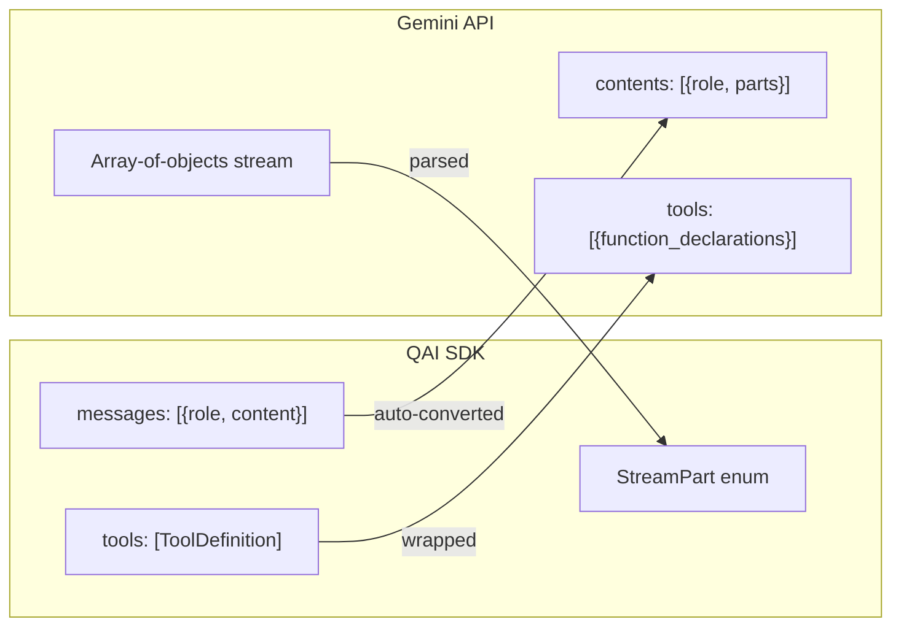

<p align="center">
  
</p>

# Google Gemini Provider (`qai_sdk::google`)

Integration with the Google Generative AI API for the Gemini multimodal model family. Translates Gemini's unique streaming array format and content structure into the standard SDK interface.

---

## Implemented Traits

| Trait | Models |
|---|---|
| `LanguageModel` | `gemini-3-flash-preview`, `gemini-2.5-flash-preview-05-20`, `gemini-2.0-flash`, `gemini-1.5-pro` |
| `EmbeddingModel` | `text-embedding-004` |
| `ImageModel` | `imagen-3.0-generate-001` |
| `VideoModel` | `veo-2.0-generate-001` |
| `MusicModel` | `lyria-3-pro-001` |
| `RealtimeModel` | `gemini-2.0-flash-exp` (Multimodal Live API) |

---

## Initialization

```rust
use qai_sdk::prelude::*;

let provider = create_google(ProviderSettings {
    api_key: Some(std::env::var("GOOGLE_API_KEY").unwrap()),
    ..Default::default()
});

let model = provider.chat("gemini-2.0-flash");
```

### Direct Instantiation

```rust
use qai_sdk::GoogleModel;
let model = GoogleModel::new(api_key);
```

---

## Chat Generation

```rust
let result = model.generate(
    Prompt {
        messages: vec![
            Message { role: Role::User, content: vec![Content::Text { text: "What is quantum computing?".into() }] },
        ],
    },
    GenerateOptions {
        model_id: "gemini-2.0-flash".into(),
        max_tokens: Some(1024),
        temperature: Some(0.8),
        ..Default::default()
    },
).await?;

println!("{}", result.text);
```

---

## Streaming

Gemini streams return arrays of JSON objects, not standard SSE. The SDK bridges this transparently:

```rust
use futures::StreamExt;

let mut stream = model.generate_stream(prompt, options).await?;

while let Some(part) = stream.next().await {
    match part {
        StreamPart::TextDelta { delta } => print!("{delta}"),
        StreamPart::Finish { finish_reason } => println!("\n[{finish_reason}]"),
        _ => {}
    }
}
```

---

## Tool Calling

```rust
let search_tool = ToolDefinition {
    name: "web_search".into(),
    description: "Search the web".into(),
    parameters: serde_json::json!({
        "type": "object",
        "properties": {
            "query": { "type": "string" }
        },
        "required": ["query"]
    }),
};

let result = model.generate(
    prompt,
    GenerateOptions {
        model_id: "gemini-2.0-flash".into(),
        tools: Some(vec![search_tool]),
        ..Default::default()
    },
).await?;

for tc in &result.tool_calls {
    println!("Gemini wants to call: {} with {}", tc.name, tc.arguments);
}
```

---

## Vision (Multimodal)

```rust
let prompt = Prompt {
    messages: vec![Message {
        role: Role::User,
        content: vec![
            Content::Text { text: "What's in this photo?".into() },
            Content::Image { source: ImageSource::Base64 {
                media_type: "image/jpeg".into(),
                data: base64_image,
            }},
        ],
    }],
};
// Images are mapped to Gemini's inline_data blobs automatically
```

---

## Embeddings

```rust
let embedder = provider.embedding("text-embedding-004");
let result = embedder.embed(
    vec!["Quantum computing basics".into()],
    EmbeddingOptions {
        model_id: "text-embedding-004".into(),
        dimensions: Some(768),
    },
).await?;

println!("Embedding dim: {}", result.embeddings[0].len());
```

---

## Safety Settings

Gemini uses configurable safety thresholds. Default balanced settings are applied automatically. Advanced customization is available through the provider settings:

| Category | Default Threshold |
|---|---|
| `HARM_CATEGORY_HARASSMENT` | `BLOCK_MEDIUM_AND_ABOVE` |
| `HARM_CATEGORY_HATE_SPEECH` | `BLOCK_MEDIUM_AND_ABOVE` |
| `HARM_CATEGORY_SEXUALLY_EXPLICIT` | `BLOCK_MEDIUM_AND_ABOVE` |
| `HARM_CATEGORY_DANGEROUS_CONTENT` | `BLOCK_MEDIUM_AND_ABOVE` |

---

## Thinking / Reasoning

Gemini 3 and 2.5 models support a "thinking" mode where the model reasons through problems step-by-step before answering. Thought summaries can be included in the response.

### Enabling Thinking

Use `reasoning_format` and `reasoning_effort` in `GenerateOptions`:

```rust
let options = GenerateOptions {
    model_id: "gemini-3-flash-preview".into(),
    max_tokens: Some(4096),
    // "parsed" or "raw" to include thought summaries in the response
    reasoning_format: Some("parsed".to_string()),
    // Gemini 3: "minimal", "low", "medium", "high"
    // Gemini 2.5: numeric budget ("1024"), "off", or "dynamic"
    reasoning_effort: Some("high".to_string()),
    ..Default::default()
};

let result = model.generate(prompt, options).await?;

// Thought summaries appear in result.reasoning
if let Some(reasoning) = &result.reasoning {
    println!("Thinking: {}", reasoning);
}
println!("Answer: {}", result.text);
```

### Streaming with Thought Deltas

In streaming mode, thought summaries arrive as `StreamPart::ReasoningDelta` events:

```rust
while let Some(part) = stream.next().await {
    match part {
        StreamPart::ReasoningDelta { delta } => print!("🧠 {}", delta),
        StreamPart::TextDelta { delta } => print!("{}", delta),
        _ => {}
    }
}
```

### Thinking Level vs Budget

| Model Series | Parameter | Values |
|---|---|---|
| Gemini 3 (`gemini-3-*`) | `thinking_level` | `"minimal"`, `"low"`, `"medium"`, `"high"` |
| Gemini 2.5 (`gemini-2.5-*`) | `thinking_budget` | `0` (off), `128`–`32768` tokens, `-1` (dynamic) |

The SDK maps `reasoning_effort` values automatically:
- `"minimal"` / `"low"` / `"medium"` / `"high"` → `thinking_level`
- `"off"` / `"none"` → `thinking_budget = 0`
- `"dynamic"` → `thinking_budget = -1`
- Numeric string (e.g. `"1024"`) → `thinking_budget = 1024`

### Thought Signatures

For enterprise use, Gemini supports **thought signatures** — cryptographically signed thinking content that can be verified for provenance and integrity. See [Thought Signatures](https://ai.google.dev/gemini-api/docs/thought-signatures) for details.

### Example

- [`gemini_thinking.rs`](../examples/gemini_thinking.rs) — Thinking with thought summaries, streaming, and budgets
- [`gemini_image_generation.rs`](../examples/gemini_image_generation.rs) — Image generation using Imagen 3

---

## Specialized Modalities

Gemini supports high-fidelity generation across multiple modalities using specialized models.

### Image Generation (Imagen 3)

```rust
let model = provider.image("imagen-3.0-generate-001");
let result = model.generate(ImageGenerateOptions {
    prompt: "A futuristic city at sunset".into(),
    ..Default::default()
}).await?;
```

### Video Generation (Veo 2)

```rust
let model = provider.video_model("veo-2.0-generate-001");
let result = model.generate(VideoGenerateOptions {
    prompt: "A drone flying through a neon canyon".into(),
    duration: Some(5.0),
    ..Default::default()
}).await?;
```

### Music Generation (Lyria)

```rust
let model = provider.music_model("lyria-3-pro-001");
let result = model.generate(MusicGenerateOptions {
    prompt: "Lo-fi hip hop beat with rain sounds".into(),
    ..Default::default()
}).await?;
```

---

## Spatial Reasoning

Gemini supports spatial reasoning through bounding boxes, useful for object detection and robotics.

```rust
let prompt = Prompt {
    messages: vec![Message {
        role: Role::User,
        content: vec![
            Content::Text { text: "Detect all cars in this image".into() },
            Content::Image { source: image_source },
        ],
    }],
};

let result = model.generate(prompt, options).await?;

for content in &result.messages.last().unwrap().content {
    if let Content::Spatial { boxes } = content {
        for b in boxes {
            println!("Car detected at: [{}, {}, {}, {}]", b.ymin, b.xmin, b.ymax, b.xmax);
        }
    }
}
```

---

## Built-in Code Execution

Gemini can execute code in a secure sandbox to solve complex problems.

```rust
let options = GenerateOptions {
    server_tools: Some(vec![
        ServerTool { tool_type: "code_execution".into(), ..Default::default() },
    ]),
    ..Default::default()
};

let result = model.generate(prompt, options).await?;

// Execution results appear in executed_tools
for et in &result.executed_tools {
    println!("Executed {}: {}", et.tool_type, et.output.as_ref().unwrap());
}
```

---

## API Differences Handled


```mermaid
flowchart LR
    subgraph "QAI SDK"
        A["messages: [{role, content}]"]
        B["tools: [ToolDefinition]"]
        C["StreamPart enum"]
    end
    
    subgraph "Gemini API"
        D["contents: [{role, parts}]"]
        E["tools: [{function_declarations}]"]
        F["Array-of-objects stream"]
    end
    
    A -->|auto-converted| D
    B -->|wrapped| E
    F -->|parsed| C
```
