<p align="center">
  
</p>

# Model Context Protocol (`qai_sdk::mcp`)

**Feature gate:** Requires `features = ["mcp"]` in `Cargo.toml`.

Complete implementation of the Model Context Protocol (MCP) — the open standard for connecting AI models to external data, tools, and services over JSON-RPC. Supports both **Stdio** and **SSE** transports.

---

## Quick Start

```toml
[dependencies]
qai-sdk = { version = "0.1", features = ["mcp"] }
```

```rust
use qai_sdk::mcp::client::McpClient;
use qai_sdk::mcp::agent::run_mcp_agent;

// Connect to an MCP server
let client = McpClient::from_stdio("npx", &["-y", "@modelcontextprotocol/server-filesystem", "."]).await?;

// Auto-discover tools and run an agent loop
let model = provider.chat("gpt-4o");
let answer = run_mcp_agent(&model, &client, "List all Rust files in this project.").await?;
println!("{}", answer);
```

---

## McpClient API Reference

### Connection Methods

```rust
// Stdio transport — launches a child process with JSON-RPC over stdin/stdout
let client = McpClient::from_stdio("npx", &["-y", "@server/name", "arg1"]).await?;

// SSE transport — connects to an HTTP SSE endpoint
let client = McpClient::from_sse("http://localhost:3000/sse").await?;
```

### Tool Operations

```rust
// Discover available tools
let tools = client.list_tools().await?;
for tool in &tools {
    println!("{}: {} | Schema: {}", tool.name, tool.description, tool.input_schema);
}

// Execute a tool
let result = client.call_tool("weather", serde_json::json!({"city": "Tokyo"})).await?;
println!("Tool result: {:?}", result.content);
```

### Prompt Operations

```rust
// List available prompt templates
let prompts = client.list_prompts().await?;
for p in &prompts {
    println!("{}: {}", p.name, p.description.as_deref().unwrap_or(""));
}

// Get a prompt with arguments
let prompt = client.get_prompt("code_review", serde_json::json!({"language": "rust"})).await?;
for msg in &prompt.messages {
    println!("[{}] {}", msg.role, msg.content.text);
}
```

### Resource Operations

```rust
// List available resources
let resources = client.list_resources().await?;
for r in &resources {
    println!("{}: {} ({})", r.name, r.uri, r.mime_type.as_deref().unwrap_or("text/plain"));
}

// Read a resource
let content = client.read_resource("file:///src/main.rs").await?;
println!("{}", content.text);

// Subscribe to resource updates (live reload)
let mut rx = client.resource_updates();
tokio::spawn(async move {
    while let Ok(uri) = rx.recv().await {
        println!("Resource updated: {uri}");
    }
});
```

---

## Auto-Tool Bridge — `run_mcp_agent`

The flagship feature: a fully automated agent loop that bridges MCP servers with any `LanguageModel`.

```mermaid
sequenceDiagram
    participant App as Client App
    participant Agent as McpAgent
    participant LLM as LanguageModel (OpenAI/etc)
    participant MCP as MCP Server

    App->>Agent: run_mcp_agent(model, client, prompt)
    
    rect rgb(30, 40, 50)
        Note over Agent, MCP: 1. Native Discovery
        Agent->>MCP: tools/list
        MCP-->>Agent: Returns Tools (Weather, FetchDoc)
    end
    
    Agent->>Agent: Inject tools into GenerateOptions

    loop Until Max Turns or Text Response
        Agent->>LLM: model.generate(prompt, options)
        LLM-->>Agent: Returns ToolCall(Weather, "Tokyo")
        
        rect rgb(50, 30, 40)
            Note over Agent, MCP: 2. JSON-RPC Resolution
            Agent->>MCP: tools/call {"name": "Weather", "loc": "Tokyo"}
            MCP-->>Agent: Returns ToolResult
        end
        
        Agent->>Agent: Update Prompt History
    end
    
    Agent-->>App: Final resolved answer
```



### Usage

```rust
use qai_sdk::mcp::agent::run_mcp_agent;

let client = McpClient::from_stdio("npx", &["-y", "@modelcontextprotocol/server-everything"]).await?;
let model = provider.chat("gpt-4o");

// Simple single-prompt usage
let answer = run_mcp_agent(&model, &client, "What tools are available?").await?;

// Advanced: multi-turn
let answer = run_mcp_agent(
    &model,
    &client,
    "Read the README.md file and summarize its contents",
).await?;
```

---

## Transport Architecture

```mermaid
graph TD
    classDef bgLoop fill:#1d2a35,stroke:#38608a
    classDef client fill:#233020,stroke:#55a535
    classDef external fill:#4a1c1d,stroke:#9b3d3d
    
    Server[MCP Server<br>STDIO / SSE]:::external
    
    subgraph McpClient Background Loops
        ReadLoop[Tokio Read Loop]:::bgLoop
        WriteLoop[Tokio Write Loop]:::bgLoop
    end
    
    Server -->|Raw JSON Strings| ReadLoop
    WriteLoop -->|Raw JSON Strings| Server
    
    ReadLoop -->|id == null| NotifFilter{Is Notification?}
    NotifFilter -->|notifications/resources/updated| BCast[tokio::broadcast::Sender]
    
    subgraph qai-sdk Frontend
        Client[McpClient]:::client
    end
    
    BCast -->|Resource URI Strings| Client
    Client -- .resource_updates --> AppStream[App rx.recv.await]
```



---

## MCP Protocol Coverage

| Capability | Method | Status |
|---|---|---|
| **Tools** | `tools/list` | ✅ Auto-discovery |
| **Tools** | `tools/call` | ✅ JSON-RPC invocation |
| **Prompts** | `prompts/list` | ✅ Template listing |
| **Prompts** | `prompts/get` | ✅ Template resolution |
| **Resources** | `resources/list` | ✅ Resource enumeration |
| **Resources** | `resources/read` | ✅ Content fetching |
| **Resources** | `resources/subscribe` | ✅ Live update notifications |
| **Resources** | `resources/templates/list` | ✅ URI template listing |
| **Transport** | Stdio (stdin/stdout) | ✅ |
| **Transport** | HTTP + SSE | ✅ |
| **Pagination** | Cursor-based | ✅ Auto-handled |

---

## Compatible MCP Servers

| Server | Install | Description |
|---|---|---|
| `@modelcontextprotocol/server-filesystem` | `npx -y @modelcontextprotocol/server-filesystem .` | File system operations |
| `@modelcontextprotocol/server-everything` | `npx -y @modelcontextprotocol/server-everything` | Demo server with all features |
| `@modelcontextprotocol/server-github` | `npx -y @modelcontextprotocol/server-github` | GitHub API access |
| `@modelcontextprotocol/server-postgres` | `npx -y @modelcontextprotocol/server-postgres` | PostgreSQL queries |
| `@modelcontextprotocol/server-brave-search` | `npx -y @modelcontextprotocol/server-brave-search` | Brave web search |
