# Model Context Protocol (MCP)

`qai-sdk` provides robust, feature-complete integration with the **Model Context Protocol (MCP)**, abstracting away JSON-RPC parsing, cursor-based pagination, and Tool JSON Schema synchronization. Using our `run_mcp_agent`, developers can natively bind connected MCP servers with standard LanguageModels automatically.

## Architectural Overview

### The Auto-Tool Bridge Dataflow

One of the largest roadblocks in standard Agentic workflows is managing the tool invocation round-trip lifecycle. With `qai-sdk`, `mcp::agent::run_mcp_agent()` handles everything transparently.

```mermaid
sequenceDiagram
    participant App as Client App
    participant Agent as McpAgent
    participant LLM as LanguageModel (OpenAI/etc)
    participant MCP as MCP Server

    App->>Agent: `run_mcp_agent(model, mcp_client, prompt)`
    
    rect rgb(30, 40, 50)
        Note over Agent, MCP: 1. Native Discovery
        Agent->>MCP: `tools/list`
        MCP-->>Agent: Returns Tools (Weather, FetchDoc)
    end
    
    Agent->>Agent: Inject tools into `GenerateOptions`

    loop Until Max Turns or Text Response
        Agent->>LLM: `model.generate(prompt, options)`
        LLM-->>Agent: Returns `ToolCall(Weather, "Tokyo")`
        
        rect rgb(50, 30, 40)
            Note over Agent, MCP: 2. JSON-RPC Resolution
            Agent->>MCP: `tools/call` {"name": "Weather", "loc": "Tokyo"}
            MCP-->>Agent: Returns `ToolResult`
        end
        
        Agent->>Agent: Update Prompt History
    end
    
    Agent-->>App: Final resolved answer
```



### Live Resource Streaming & STDIO Loops

For data-heavy operations, the `McpClient` runs independent background IO loops in Tokio capable of trapping asynchronous un-id'd `JsonRpcNotification` triggers, propagating them gracefully up to safe asynchronous broadcast receivers.

```mermaid
graph TD
    classDef bgLoop fill:#1d2a35,stroke:#38608a
    classDef client fill:#233020,stroke:#55a535
    classDef external fill:#4a1c1d,stroke:#9b3d3d
    
    Server[MCP Server <br> STDIO / SSE]:::external
    
    subgraph `McpClient Background Loops`
        ReadLoop[Tokio Read Loop]:::bgLoop
        WriteLoop[Tokio Write Loop]:::bgLoop
    end
    
    Server -->|Raw JSON Strings| ReadLoop
    WriteLoop -->|Raw JSON Strings| Server
    
    ReadLoop -->|id == null| NotifFilter{Is Notification?}
    NotifFilter -->|notifications/resources/updated| BCast[tokio::broadcast::Sender]
    
    subgraph `qai-sdk Frontend`
        Client[McpClient]:::client
    end
    
    BCast -->|Resource URI Strings| Client
    Client -- `.resource_updates()` --> AppStream[App `rx.recv().await`]
```

## Features Supported

- **Tools (`tools/list`, `tools/call`)**: Fully integrated into the Auto-Tool Bridge. Auto maps constraints for generating schemas directly into the unified interface of generic tool models handling LLM injections seamlessly.
- **Prompts (`prompts/list`, `prompts/get`)**: Implemented natively bridging remote template parsing locally.
- **Resources (`resources/*`)**: Seamless fetching, listing, and real-time live subscriptions (`notifications/resources/updated`) mapped elegantly to cross-thread stream receivers avoiding threading blocks.
