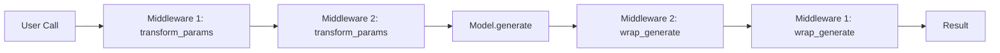

<p align="center">
  
</p>

# Middleware Layer

Composable wrappers that intercept and transform language model calls.

## Core Concept



## Usage

```rust
use qai_sdk::core::middleware::*;

// Wrap a model with default settings
let wrapped = wrap_language_model(
    model,
    vec![
        Box::new(DefaultSettingsMiddleware {
            temperature: Some(0.7),
            max_tokens: Some(4096),
            top_p: None,
        }),
        Box::new(ExtractReasoningMiddleware::default()),
    ],
);

// Now every call auto-injects defaults and strips <think> tags
let result = wrapped.generate(prompt, options).await?;
```

## Built-in Middlewares

### `DefaultSettingsMiddleware`
Injects default `temperature`, `max_tokens`, and `top_p` when not explicitly set by the caller.

### `ExtractReasoningMiddleware`
Strips `<think>...</think>` blocks from model output, leaving only clean response text. Useful for reasoning models like DeepSeek-R1 and QwQ.

## Custom Middleware

```rust
use qai_sdk::core::middleware::*;
use async_trait::async_trait;

struct LoggingMiddleware;

#[async_trait]
impl LanguageModelMiddleware for LoggingMiddleware {
    async fn transform_params(
        &self,
        options: GenerateOptions,
    ) -> Result<GenerateOptions> {
        println!("Model: {} | Temp: {:?}", options.model_id, options.temperature);
        Ok(options)
    }
}
```
