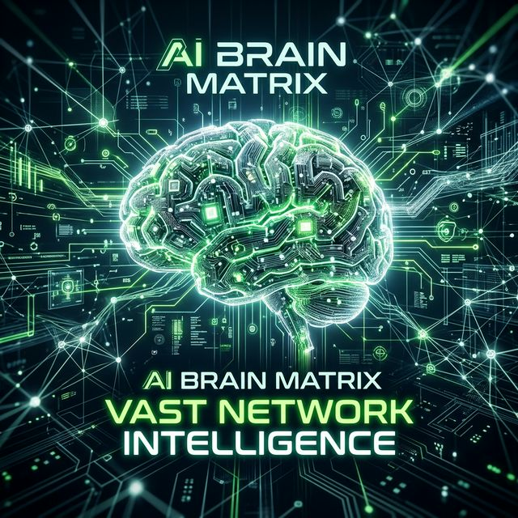

<p align="center">
  
</p>

# OpenAI Provider (`qai_sdk::openai`)

The most comprehensive provider in the SDK. Fully covers the OpenAI API surface: GPT models, DALL-E, Whisper, TTS, and the Responses API.

---

## Implemented Traits

| Trait | Models | Feature |
|---|---|---|
| `LanguageModel` | GPT-4o, GPT-4o-mini, GPT-4-turbo, GPT-3.5-turbo, o1, o1-mini | Chat, streaming, tool calling, vision |
| `EmbeddingModel` | text-embedding-3-large, text-embedding-3-small, text-embedding-ada-002 | Vector embeddings |
| `ImageModel` | DALL-E 3, DALL-E 2 | Image generation |
| `SpeechModel` | tts-1, tts-1-hd | Text-to-speech |
| `TranscriptionModel` | whisper-1 | Speech-to-text |
| `CompletionModel` | gpt-3.5-turbo-instruct | Legacy text completion |

---

## Initialization

```rust
use qai_sdk::prelude::*;

// Via universal factory
let provider = create_openai(ProviderSettings {
    api_key: Some(std::env::var("OPENAI_API_KEY").unwrap()),
    ..Default::default()
});
let model = provider.chat("gpt-4o");

// Direct instantiation
use qai_sdk::OpenAIModel;
let model = OpenAIModel::new(api_key);
```

### Custom Base URL (Azure, proxies)

```rust
let provider = create_openai(ProviderSettings {
    api_key: Some("your-azure-key".into()),
    base_url: Some("https://your-deployment.openai.azure.com/openai/deployments/gpt-4o".into()),
    ..Default::default()
});
```

---

## Chat Generation

```rust
let result = model.generate(
    Prompt {
        messages: vec![
            Message { role: Role::System, content: vec![Content::Text { text: "You are helpful.".into() }] },
            Message { role: Role::User, content: vec![Content::Text { text: "What is Rust?".into() }] },
        ],
    },
    GenerateOptions {
        model_id: "gpt-4o".into(),
        max_tokens: Some(500),
        temperature: Some(0.7),
        top_p: None,
        stop_sequences: None,
        tools: None,
    },
).await?;

println!("Response: {}", result.text);
println!("Tokens: {} prompt + {} completion", result.usage.prompt_tokens, result.usage.completion_tokens);
```

---

## Streaming

```rust
use futures::StreamExt;

let mut stream = model.generate_stream(prompt, options).await?;

while let Some(part) = stream.next().await {
    match part {
        StreamPart::TextDelta { delta } => print!("{delta}"),
        StreamPart::ToolCallDelta { name, arguments_delta, .. } => {
            if let Some(n) = name { print!("[tool: {n}] "); }
            if let Some(a) = arguments_delta { print!("{a}"); }
        }
        StreamPart::Usage { usage } => println!("\n[{} tokens]", usage.prompt_tokens + usage.completion_tokens),
        StreamPart::Finish { finish_reason } => println!("\n[Done: {finish_reason}]"),
        StreamPart::Error { message } => eprintln!("\n[Error: {message}]"),
    }
}
```

---

## Tool Calling (Function Calling)

```rust
let weather_tool = ToolDefinition {
    name: "get_weather".into(),
    description: "Get current weather for a location".into(),
    parameters: serde_json::json!({
        "type": "object",
        "properties": {
            "location": { "type": "string", "description": "City name" },
            "unit": { "type": "string", "enum": ["celsius", "fahrenheit"] }
        },
        "required": ["location"]
    }),
};

let result = model.generate(
    prompt,
    GenerateOptions {
        model_id: "gpt-4o".into(),
        tools: Some(vec![weather_tool]),
        ..Default::default()
    },
).await?;

for tc in &result.tool_calls {
    println!("Tool: {} | Args: {}", tc.name, tc.arguments);
}
```

---

## Vision (Multimodal)

```rust
let prompt = Prompt {
    messages: vec![Message {
        role: Role::User,
        content: vec![
            Content::Text { text: "What's in this image?".into() },
            Content::Image { source: ImageSource::Base64 {
                media_type: "image/png".into(),
                data: base64_encoded_image,
            }},
        ],
    }],
};
```

---

## Embeddings

```rust
let embedder = provider.embedding("text-embedding-3-small");
let result = embedder.embed(
    vec!["Hello world".into(), "Rust is fast".into()],
    EmbeddingOptions { model_id: "text-embedding-3-small".into(), dimensions: Some(256) },
).await?;

println!("Vectors: {} x {}d", result.embeddings.len(), result.embeddings[0].len());
```

---

## Image Generation

```rust
let imager = provider.image("dall-e-3");
let result = imager.generate(ImageGenerateOptions {
    model_id: "dall-e-3".into(),
    prompt: "A futuristic Rust crab in space".into(),
    n: Some(1),
    size: Some("1024x1024".into()),
    quality: Some("hd".into()),
    response_format: Some("url".into()),
}).await?;

println!("Image URL: {}", result.images[0]);
```

---

## Text-to-Speech

```rust
let tts = provider.speech("tts-1-hd");
let result = tts.synthesize(SpeechOptions {
    model_id: "tts-1-hd".into(),
    input: "Hello from QAI SDK!".into(),
    voice: "alloy".into(),
    response_format: Some("mp3".into()),
    speed: Some(1.0),
}).await?;

std::fs::write("output.mp3", &result.audio)?;
```

---

## Transcription (Speech-to-Text)

```rust
let whisper = provider.transcription("whisper-1");
let audio_bytes = std::fs::read("recording.mp3")?;

let result = whisper.transcribe(TranscriptionOptions {
    model_id: "whisper-1".into(),
    audio: audio_bytes,
    language: Some("en".into()),
    prompt: None,
    temperature: None,
}).await?;

println!("Transcript: {}", result.text);
```

---

## Responses API

```rust
let responses_client = provider.responses("gpt-4o");
let result = responses_client.create(request).await?;
```
