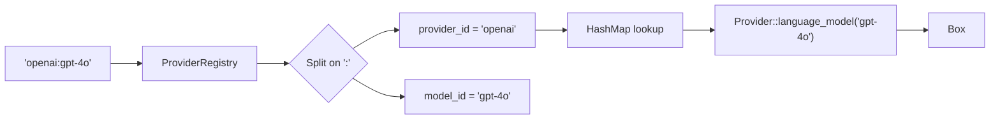

<p align="center">
  
</p>

# Provider Registry

Centralized registry that resolves `"provider:model"` strings into live trait objects.

## Usage

```rust
use qai_sdk::core::registry::{ProviderRegistry, Provider};

// Register providers
let registry = ProviderRegistry::new()
    .register("openai", my_openai_provider)
    .register("anthropic", my_anthropic_provider)
    .register("google", my_google_provider);

// Resolve by string
let model = registry.language_model("openai:gpt-4o")?;
let embedder = registry.embedding_model("openai:text-embedding-3-small")?;
let imager = registry.image_model("openai:dall-e-3")?;
```

## Architecture



## Implementing the `Provider` Trait

```rust
use qai_sdk::core::registry::Provider;
use qai_sdk::core::LanguageModel;

struct MyProvider { settings: ProviderSettings }

impl Provider for MyProvider {
    fn language_model(&self, model_id: &str) -> Option<Box<dyn LanguageModel>> {
        Some(Box::new(MyModel::new(model_id, &self.settings)))
    }
}
```

## Custom Separator

```rust
// Use '/' instead of ':'
let registry = ProviderRegistry::with_separator('/')
    .register("openai", provider);

let model = registry.language_model("openai/gpt-4o")?;
```
