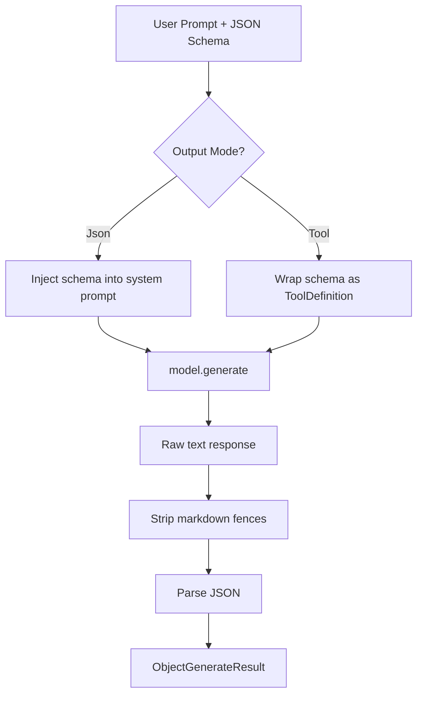

<p align="center">
  
</p>

# Structured Output — `generate_object`

Force any language model to return **validated JSON** conforming to a JSON Schema.

## Output Modes

| Mode | How it works | Best for |
|---|---|---|
| `Json` | Injects schema as a system instruction, model returns raw JSON | OpenAI, Gemini (native JSON mode) |
| `Tool` | Wraps schema as a fake tool definition to force structured output | Anthropic, any provider with tool calling |

## Usage

```rust
use qai_sdk::core::structured::*;

let result = generate_object(
    &model,
    "Generate a user profile for Jane, age 25, engineer",
    ObjectGenerateOptions {
        model_id: "gpt-4o".to_string(),
        schema: serde_json::json!({
            "type": "object",
            "properties": {
                "name": { "type": "string" },
                "age": { "type": "integer" },
                "role": { "type": "string" }
            },
            "required": ["name", "age", "role"]
        }),
        mode: OutputMode::Json,
        ..Default::default()
    },
).await?;

// result.object => {"name": "Jane", "age": 25, "role": "engineer"}
```

## How It Works



## Key Types

- **`ObjectGenerateOptions`** — Schema, mode, model params
- **`ObjectGenerateResult`** — `.object` (parsed JSON), `.raw_text`, `.usage`
- **`OutputMode`** — `Json` or `Tool`
