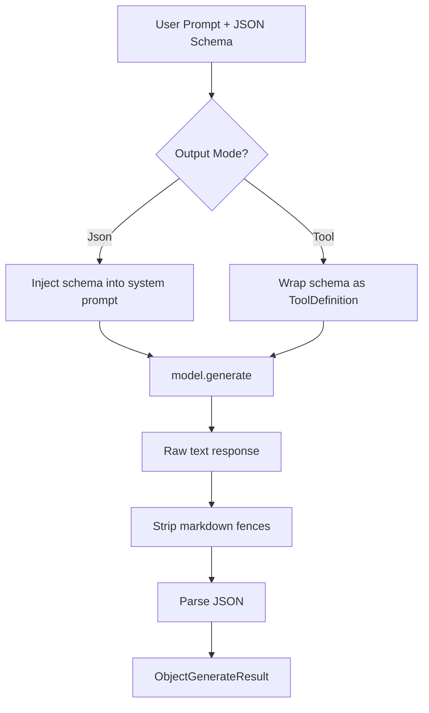

<p align="center">
  
</p>

# Structured Output — `generate_object`

Force any language model to return **validated JSON** conforming to a JSON Schema.

## Output Modes

| Mode | How it works | Best for |
|---|---|---|
| `Json` | Injects schema as a system instruction, model returns raw JSON | OpenAI, Gemini (native JSON mode) |
| `Tool` | Wraps schema as a fake tool definition to force structured output | Anthropic, any provider with tool calling |

## Usage

```rust
use qai_sdk::core::structured::*;

let result = generate_object(
    &model,
    "Generate a user profile for Jane, age 25, engineer",
    ObjectGenerateOptions {
        model_id: "gpt-4o".to_string(),
        schema: serde_json::json!({
            "type": "object",
            "properties": {
                "name": { "type": "string" },
                "age": { "type": "integer" },
                "role": { "type": "string" }
            },
            "required": ["name", "age", "role"]
        }),
        mode: OutputMode::Json,
        ..Default::default()
    },
).await?;

// result.object => {"name": "Jane", "age": 25, "role": "engineer"}
```

## How It Works


```mermaid
flowchart TD
    A[User Prompt + JSON Schema] --> B{Output Mode?}
    B -->|Json| C[Inject schema into system prompt]
    B -->|Tool| D[Wrap schema as ToolDefinition]
    C --> E[model.generate]
    D --> E
    E --> F[Raw text response]
    F --> G[Strip markdown fences]
    G --> H[Parse JSON]
    H --> I[ObjectGenerateResult]
```

## Key Types

- **`ObjectGenerateOptions`** — Schema, mode, model params, and `strict` flag.
- **`ObjectGenerateResult`** — `.object` (parsed JSON), `.raw_text`, `.usage`
- **`OutputMode`** — `Json` or `Tool`

## Strict Mode

By default, the SDK sets `"strict": true` when generating structured JSON (which forces the model to use constrained decoding). However, some models or providers (like many Groq models) may only support best-effort structured outputs. You can disable strict mode explicitly:

```rust
ObjectGenerateOptions {
    model_id: "meta-llama/llama-4-scout-17b-16e-instruct".to_string(),
    schema: ...,
    strict: Some(false), // Disable strict mode for best-effort schema adherence
    ..Default::default()
}
```
